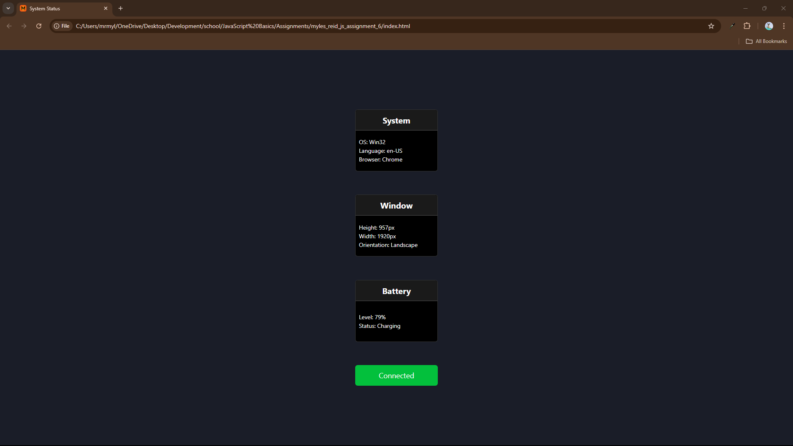

# System Status

Simple little app that reads the current status of some of your system information 
using BOM. Dynamically updates whenever the dynamic values change, such as window 
height and width.

---

## Features

- Displays useful information such as:
    - OS
    - Language
    - Browser
    - Battery status
    - Network Connection status

---

## Lessons Learned

There were some challenges in this that I still am not 100% confident in 
understanding. The biggest challenge was getting the battery status to update 
dynamically. I am still not fully sure I understand how it is working, but I 
got it in the end. I will admit that I used chatGPT to start to get an 
understanding, and while I used AI I still wrote the code myself first and 
got it to check when I ran into roadblocks.

While working on the gathering the browser data and displaying the correct one, 
I came across the switch(true) statement. While on first glance it looked wrong, 
seeing as I have always learnt to not hard code a boolean, after further 
review it makes much more sense.

---

## Screenshots

---

  
  
   

